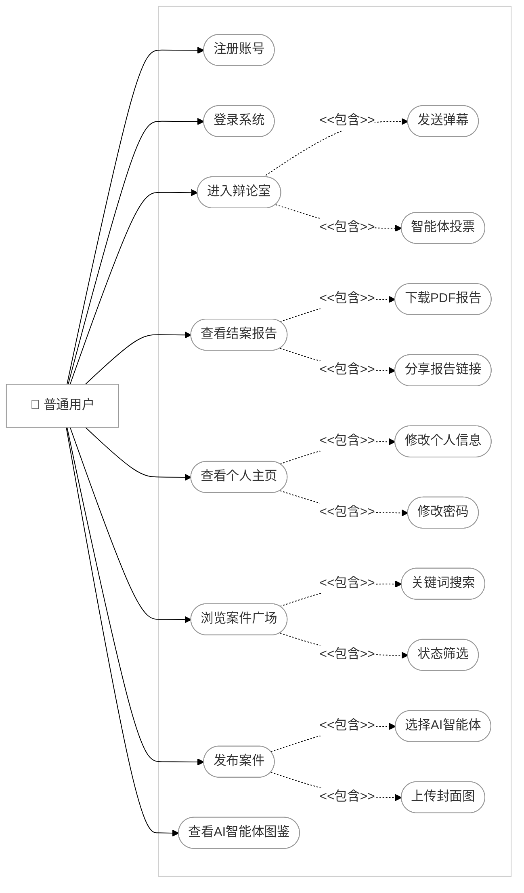
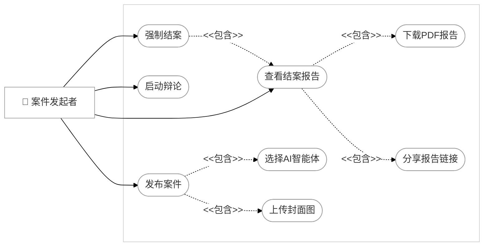
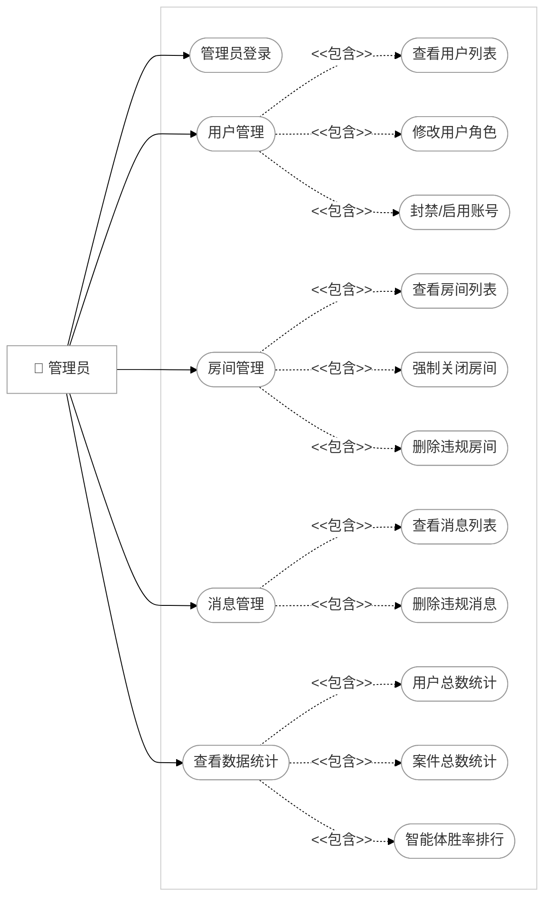
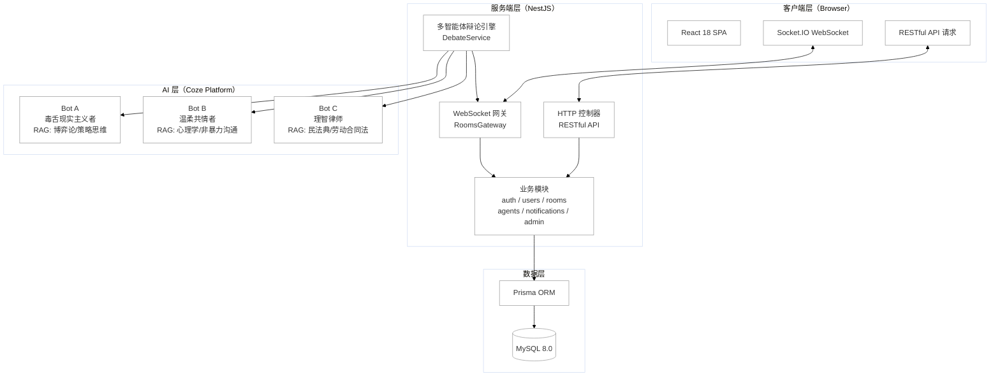
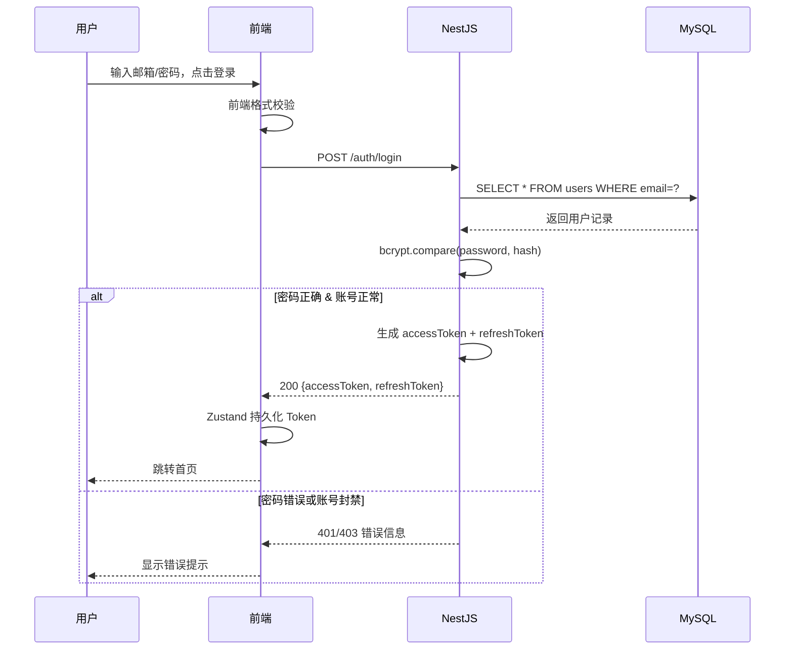
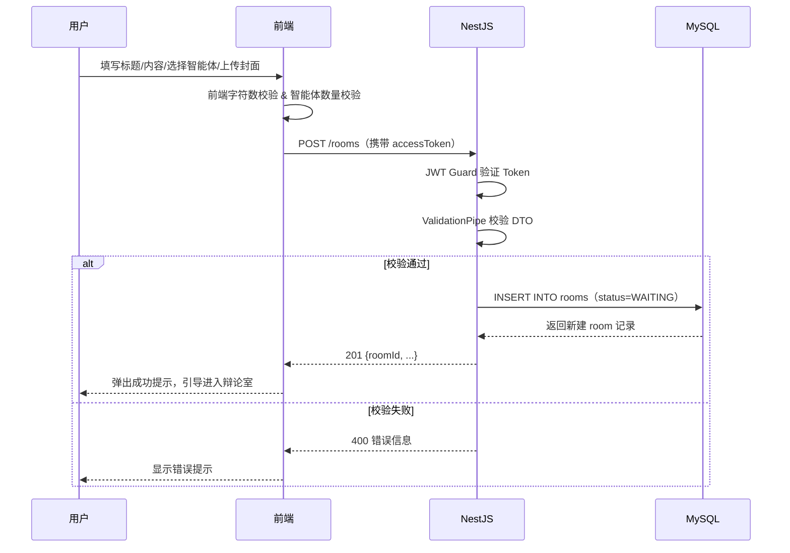
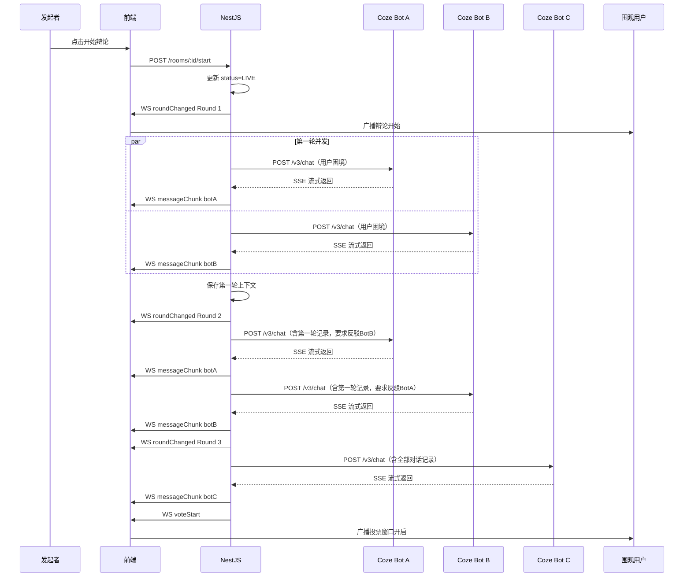
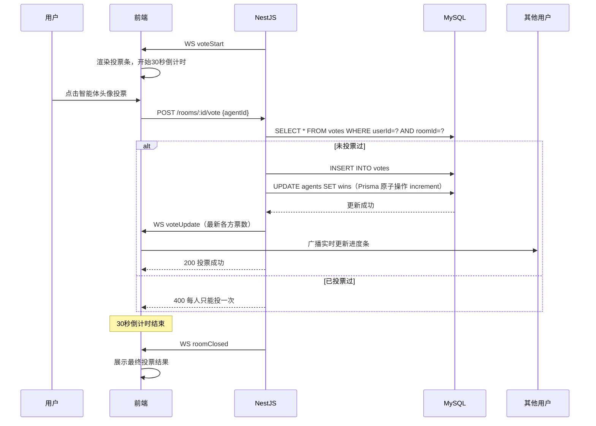
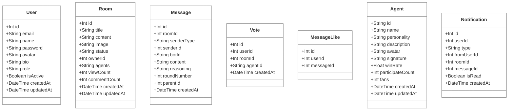

# 毕设图表（Mermaid 格式）

> 使用说明：将各图代码块粘贴至 [Mermaid Live Editor](https://mermaid.live/) 即可导出 PNG/SVG
>
> 思维导图推荐使用 [ProcessOn](https://www.processon.com/) 或 [XMind](https://xmind.cn/) 绘制，效果更接近参考图样式

---

## 功能结构图（思维导图）

> 使用方式：打开 [markmap.js.org/repl](https://markmap.js.org/repl)，将下方代码块内容粘贴至左侧编辑区，右侧即可实时预览思维导图，点击右上角可导出 SVG/PNG。
> 需要调整功能项时直接修改下方内容即可。

```markdown
# AI多智能体辩论平台

## 普通用户端

### 首页

### 注册与登录

#### 邮箱注册

#### 密码登录

#### Token自动刷新

### 案件广场

#### 状态筛选

#### 关键词搜索

#### 排序切换

#### 分页浏览

### 发布案件

#### 填写标题与内容

#### 选择AI智能体

#### 上传封面图

### 辩论室

#### 实时围观辩论

#### 查看辩论历史

#### 弹幕聊天互动

#### 查看在线人数

### 智能体投票

#### 30秒投票窗口

#### 投票操作

#### 投票结果展示

### 结案报告

#### 查看辩论记录

#### 下载PDF报告

#### 分享报告链接

### 个人主页

#### 查看发布的案件

#### 查看投票记录

#### 修改个人信息

#### 修改密码

### AI智能体图鉴

#### 查看智能体人设

#### 查看历史胜率

#### 查看标志性语录

## 案件发起者端

### 启动辩论

### 强制结案

### 下载结案报告

### 分享报告

## 管理员端

### 数据统计

#### 用户总数

#### 案件总数

#### 消息总数

#### 智能体胜率排行

### 用户管理

#### 查看用户列表

#### 修改用户角色

#### 封禁账号

#### 启用账号

### 房间管理

#### 查看房间列表

#### 强制关闭房间

#### 删除违规房间

### 消息管理

#### 查看消息列表

#### 删除违规消息
```

---

## 用例图1 普通用户用例图



---

## 用例图2 案件发起者用例图



---

## 用例图3 管理员用例图



---

## 图1 系统总体架构图



---

## 图2 登录注册流程图

> 使用方式：打开 [app.diagrams.net](https://app.diagrams.net) → 其它 → 编辑图表 → 粘贴以下 XML → 确定

```xml
<mxGraphModel dx="1222" dy="790" grid="1" gridSize="10" guides="1" tooltips="1" connect="1" arrows="1" fold="1" page="1" pageScale="1" pageWidth="827" pageHeight="1169" math="0" shadow="0">
  <root>
    <mxCell id="0" />
    <mxCell id="1" parent="0" />
    <mxCell id="2" parent="1" style="ellipse;whiteSpace=wrap;" value="开始" vertex="1">
      <mxGeometry height="40" width="80" x="40" y="200" as="geometry" />
    </mxCell>
    <mxCell id="3" parent="1" style="rhombus;whiteSpace=wrap;" value="是否有账号?" vertex="1">
      <mxGeometry height="80" width="120" x="150" y="180" as="geometry" />
    </mxCell>
    <mxCell id="4" parent="1" style="rounded=0;whiteSpace=wrap;" value="输入邮箱/密码" vertex="1">
      <mxGeometry height="50" width="140" x="300" y="100" as="geometry" />
    </mxCell>
    <mxCell id="5" parent="1" style="rhombus;whiteSpace=wrap;" value="密码验证通过?" vertex="1">
      <mxGeometry height="90" width="130" x="530" y="80" as="geometry" />
    </mxCell>
    <mxCell id="6" parent="1" style="rhombus;whiteSpace=wrap;" value="账号封禁?" vertex="1">
      <mxGeometry height="90" width="120" x="710" y="80" as="geometry" />
    </mxCell>
    <mxCell id="8" parent="1" style="rounded=0;whiteSpace=wrap;" value="颁发双Token" vertex="1">
      <mxGeometry height="50" width="120" x="880" y="160" as="geometry" />
    </mxCell>
    <mxCell id="9" parent="1" style="ellipse;whiteSpace=wrap;" value="结束" vertex="1">
      <mxGeometry height="50" width="80" x="1060" y="160" as="geometry" />
    </mxCell>
    <mxCell id="10" parent="1" style="rounded=0;whiteSpace=wrap;" value="填写邮箱/用户名/密码" vertex="1">
      <mxGeometry height="50" width="140" x="300" y="250" as="geometry" />
    </mxCell>
    <mxCell id="11" parent="1" style="rhombus;whiteSpace=wrap;" value="格式校验" vertex="1">
      <mxGeometry height="90" width="120" x="490" y="230" as="geometry" />
    </mxCell>
    <mxCell id="12" parent="1" style="rhombus;whiteSpace=wrap;" value="邮箱已存在?" vertex="1">
      <mxGeometry height="90" width="130" x="697" y="240" as="geometry" />
    </mxCell>
    <mxCell id="13" parent="1" style="rounded=0;whiteSpace=wrap;" value="哈希密码写入数据库" vertex="1">
      <mxGeometry height="50" width="140" x="900" y="260" as="geometry" />
    </mxCell>
    <mxCell id="e1" edge="1" parent="1" source="2" target="3">
      <mxGeometry relative="1" as="geometry" />
    </mxCell>
    <mxCell id="e2" edge="1" parent="1" source="3" target="4" value="是">
      <mxGeometry relative="1" as="geometry" />
    </mxCell>
    <mxCell id="e3" edge="1" parent="1" source="3" target="10" value="否">
      <mxGeometry relative="1" as="geometry" />
    </mxCell>
    <mxCell id="e4" edge="1" parent="1" source="4" target="5">
      <mxGeometry relative="1" as="geometry" />
    </mxCell>
    <mxCell id="e5" edge="1" parent="1" source="5" target="4" value="否">
      <mxGeometry relative="1" as="geometry">
        <Array as="points">
          <mxPoint x="595" y="60" />
          <mxPoint x="410" y="60" />
        </Array>
      </mxGeometry>
    </mxCell>
    <mxCell id="e6" edge="1" parent="1" source="5" target="6" value="是">
      <mxGeometry relative="1" as="geometry" />
    </mxCell>
    <mxCell id="e7" edge="1" parent="1" source="6" style="entryX=0;entryY=0.5;entryDx=0;entryDy=0;" target="9" value="是">
      <mxGeometry relative="1" as="geometry">
        <Array as="points">
          <mxPoint x="1060" y="125" />
        </Array>
        <mxPoint x="883" y="95" as="targetPoint" />
      </mxGeometry>
    </mxCell>
    <mxCell id="e8" edge="1" parent="1" source="6" target="8" value="否">
      <mxGeometry relative="1" as="geometry" />
    </mxCell>
    <mxCell id="e9" edge="1" parent="1" source="8" target="9">
      <mxGeometry relative="1" as="geometry" />
    </mxCell>
    <mxCell id="e10" edge="1" parent="1" source="10" target="11">
      <mxGeometry relative="1" as="geometry" />
    </mxCell>
    <mxCell id="e11" edge="1" parent="1" source="11" target="10" value="不通过">
      <mxGeometry relative="1" as="geometry">
        <Array as="points">
          <mxPoint x="550" y="340" />
          <mxPoint x="370" y="340" />
        </Array>
      </mxGeometry>
    </mxCell>
    <mxCell id="e12" edge="1" parent="1" source="11" target="12" value="通过">
      <mxGeometry relative="1" as="geometry" />
    </mxCell>
    <mxCell id="e13" edge="1" parent="1" source="12" target="10" value="是">
      <mxGeometry relative="1" as="geometry">
        <Array as="points">
          <mxPoint x="765" y="380" />
          <mxPoint x="370" y="380" />
        </Array>
      </mxGeometry>
    </mxCell>
    <mxCell id="e14" edge="1" parent="1" source="12" target="13" value="否">
      <mxGeometry relative="1" as="geometry" />
    </mxCell>
    <mxCell id="e15" edge="1" parent="1" source="13" target="8">
      <mxGeometry relative="1" as="geometry">
        <Array as="points">
          <mxPoint x="950" y="240" />
        </Array>
      </mxGeometry>
    </mxCell>
  </root>
</mxGraphModel>

```

---

## 图3 案件广场流程图

> 使用方式：打开 [app.diagrams.net](https://app.diagrams.net) → 其它 → 编辑图表 → 粘贴以下 XML → 确定

```xml
<mxGraphModel><root><mxCell id="0"/><mxCell id="1" parent="0"/>
<mxCell id="2" value="开始" style="ellipse;whiteSpace=wrap;" vertex="1" parent="1"><mxGeometry x="40" y="160" width="80" height="40" as="geometry"/></mxCell>
<mxCell id="3" value="GET /rooms" style="rounded=0;whiteSpace=wrap;" vertex="1" parent="1"><mxGeometry x="170" y="155" width="130" height="50" as="geometry"/></mxCell>
<mxCell id="4" value="渲染案件卡片列表" style="rounded=0;whiteSpace=wrap;" vertex="1" parent="1"><mxGeometry x="350" y="155" width="140" height="50" as="geometry"/></mxCell>
<mxCell id="5" value="用户操作?" style="rhombus;whiteSpace=wrap;" vertex="1" parent="1"><mxGeometry x="540" y="135" width="130" height="90" as="geometry"/></mxCell>
<mxCell id="6" value="状态筛选/搜索/排序/翻页" style="rounded=0;whiteSpace=wrap;" vertex="1" parent="1"><mxGeometry x="540" y="60" width="180" height="50" as="geometry"/></mxCell>
<mxCell id="7" value="结束" style="ellipse;whiteSpace=wrap;" vertex="1" parent="1"><mxGeometry x="730" y="155" width="80" height="50" as="geometry"/></mxCell>
<mxCell id="8" value="结束" style="ellipse;whiteSpace=wrap;" vertex="1" parent="1"><mxGeometry x="870" y="155" width="80" height="50" as="geometry"/></mxCell>
<mxCell id="e1" edge="1" source="2" target="3" parent="1"><mxGeometry relative="1" as="geometry"/></mxCell>
<mxCell id="e2" edge="1" source="3" target="4" parent="1"><mxGeometry relative="1" as="geometry"/></mxCell>
<mxCell id="e3" edge="1" source="4" target="5" parent="1"><mxGeometry relative="1" as="geometry"/></mxCell>
<mxCell id="e4" value="筛选/搜索/翻页" edge="1" source="5" target="6" parent="1"><mxGeometry relative="1" as="geometry"/></mxCell>
<mxCell id="e5" edge="1" source="6" target="3" parent="1"><mxGeometry relative="1" as="geometry"><Array as="points"><mxPoint x="630" y="40"/><mxPoint x="235" y="40"/></Array></mxGeometry></mxCell>
<mxCell id="e6" value="点击卡片" edge="1" source="5" target="7" parent="1"><mxGeometry relative="1" as="geometry"/></mxCell>
<mxCell id="e7" edge="1" source="7" target="8" parent="1"><mxGeometry relative="1" as="geometry"/></mxCell>
</root></mxGraphModel>
```

---

## 图4 发布案件流程图

> 使用方式：打开 [app.diagrams.net](https://app.diagrams.net) → 其它 → 编辑图表 → 粘贴以下 XML → 确定

```xml
<mxGraphModel dx="1222" dy="790" grid="0" gridSize="10" guides="1" tooltips="1" connect="1" arrows="1" fold="1" page="0" pageScale="1" pageWidth="827" pageHeight="1169" math="0" shadow="0">
  <root>
    <mxCell id="0" />
    <mxCell id="1" parent="0" />
    <mxCell id="2" parent="1" style="ellipse;whiteSpace=wrap;" value="开始" vertex="1">
      <mxGeometry height="40" width="80" x="40" y="200" as="geometry" />
    </mxCell>
    <mxCell id="3" parent="1" style="rounded=0;whiteSpace=wrap;" value="填写标题与内容" vertex="1">
      <mxGeometry height="50" width="130" x="170" y="195" as="geometry" />
    </mxCell>
    <mxCell id="4" parent="1" style="rhombus;whiteSpace=wrap;" value="字符数校验" vertex="1">
      <mxGeometry height="90" width="120" x="350" y="175" as="geometry" />
    </mxCell>
    <mxCell id="5" parent="1" style="rounded=0;whiteSpace=wrap;" value="选择3个AI智能体" vertex="1">
      <mxGeometry height="50" width="130" x="530" y="195" as="geometry" />
    </mxCell>
    <mxCell id="6" parent="1" style="rhombus;whiteSpace=wrap;" value="已选满3个?" vertex="1">
      <mxGeometry height="90" width="120" x="710" y="175" as="geometry" />
    </mxCell>
    <mxCell id="7" parent="1" style="rounded=0;whiteSpace=wrap;" value="可选上传封面图" vertex="1">
      <mxGeometry height="50" width="130" x="890" y="195" as="geometry" />
    </mxCell>
    <mxCell id="8" parent="1" style="rounded=0;whiteSpace=wrap;" value="POST /rooms" vertex="1">
      <mxGeometry height="50" width="120" x="1080" y="195" as="geometry" />
    </mxCell>
    <mxCell id="9" parent="1" style="rhombus;whiteSpace=wrap;" value="后端校验通过?" vertex="1">
      <mxGeometry height="90" width="130" x="1080" y="310" as="geometry" />
    </mxCell>
    <mxCell id="10" parent="1" style="rounded=0;whiteSpace=wrap;" value="写入rooms表" vertex="1">
      <mxGeometry height="50" width="130" x="890" y="330" as="geometry" />
    </mxCell>
    <mxCell id="11" parent="1" style="rhombus;whiteSpace=wrap;" value="用户选择" vertex="1">
      <mxGeometry height="90" width="120" x="710" y="310" as="geometry" />
    </mxCell>
    <mxCell id="13" parent="1" style="ellipse;whiteSpace=wrap;" value="结束" vertex="1">
      <mxGeometry height="50" width="80" x="409" y="328" as="geometry" />
    </mxCell>
    <mxCell id="e1" edge="1" parent="1" source="2" target="3">
      <mxGeometry relative="1" as="geometry" />
    </mxCell>
    <mxCell id="e2" edge="1" parent="1" source="3" target="4">
      <mxGeometry relative="1" as="geometry" />
    </mxCell>
    <mxCell id="e3" edge="1" parent="1" source="4" target="3" value="不满足">
      <mxGeometry relative="1" as="geometry">
        <Array as="points">
          <mxPoint x="410" y="150" />
          <mxPoint x="235" y="150" />
        </Array>
      </mxGeometry>
    </mxCell>
    <mxCell id="e4" edge="1" parent="1" source="4" target="5" value="满足">
      <mxGeometry relative="1" as="geometry" />
    </mxCell>
    <mxCell id="e5" edge="1" parent="1" source="5" target="6">
      <mxGeometry relative="1" as="geometry" />
    </mxCell>
    <mxCell id="e6" edge="1" parent="1" source="6" target="5" value="否">
      <mxGeometry relative="1" as="geometry">
        <Array as="points">
          <mxPoint x="770" y="150" />
          <mxPoint x="595" y="150" />
        </Array>
      </mxGeometry>
    </mxCell>
    <mxCell id="e7" edge="1" parent="1" source="6" style="entryX=0;entryY=0.5;entryDx=0;entryDy=0;" target="7" value="是">
      <mxGeometry relative="1" as="geometry" />
    </mxCell>
    <mxCell id="e8" edge="1" parent="1" source="7" target="8">
      <mxGeometry relative="1" as="geometry" />
    </mxCell>
    <mxCell id="e9" edge="1" parent="1" source="8" target="9">
      <mxGeometry relative="1" as="geometry" />
    </mxCell>
    <mxCell id="e10" edge="1" parent="1" source="9" target="3" value="否">
      <mxGeometry relative="1" as="geometry">
        <Array as="points">
          <mxPoint x="1145" y="430" />
          <mxPoint x="235" y="430" />
        </Array>
      </mxGeometry>
    </mxCell>
    <mxCell id="e11" edge="1" parent="1" source="9" target="10" value="是">
      <mxGeometry relative="1" as="geometry" />
    </mxCell>
    <mxCell id="e12" edge="1" parent="1" source="10" target="11">
      <mxGeometry relative="1" as="geometry" />
    </mxCell>
    <mxCell id="e14" edge="1" parent="1" source="11" target="13" value="返回首页 or 进入辩论室">
      <mxGeometry relative="1" x="0.0023" as="geometry">
        <mxPoint as="offset" />
      </mxGeometry>
    </mxCell>
  </root>
</mxGraphModel>

```

---

## 图5 辩论室流程图

> 使用方式：打开 [app.diagrams.net](https://app.diagrams.net) → 其它 → 编辑图表 → 粘贴以下 XML → 确定

```xml
<mxGraphModel dx="1222" dy="790" grid="0" gridSize="10" guides="1" tooltips="1" connect="1" arrows="1" fold="1" page="0" pageScale="1" pageWidth="827" pageHeight="1169" math="0" shadow="0">
  <root>
    <mxCell id="0" />
    <mxCell id="1" parent="0" />
    <mxCell id="2" parent="1" style="ellipse;whiteSpace=wrap;" value="开始" vertex="1">
      <mxGeometry height="40" width="80" x="40" y="200" as="geometry" />
    </mxCell>
    <mxCell id="3" parent="1" style="rounded=0;whiteSpace=wrap;" value="Socket.IO连接加入房间" vertex="1">
      <mxGeometry height="50" width="150" x="170" y="195" as="geometry" />
    </mxCell>
    <mxCell id="4" parent="1" style="rhombus;whiteSpace=wrap;" value="案件状态?" vertex="1">
      <mxGeometry height="90" width="120" x="370" y="175" as="geometry" />
    </mxCell>
    <mxCell id="5" parent="1" style="rounded=0;whiteSpace=wrap;" value="回放历史记录" vertex="1">
      <mxGeometry height="50" width="120" x="370" y="60" as="geometry" />
    </mxCell>
    <mxCell id="6" parent="1" style="rhombus;whiteSpace=wrap;" value="是否为发起者?" vertex="1">
      <mxGeometry height="90" width="130" x="547" y="117" as="geometry" />
    </mxCell>
    <mxCell id="7" parent="1" style="rounded=0;whiteSpace=wrap;" value="等待辩论开始" vertex="1">
      <mxGeometry height="50" width="130" x="547" y="12" as="geometry" />
    </mxCell>
    <mxCell id="8" parent="1" style="rounded=0;whiteSpace=wrap;" value="POST /rooms/:id/start" vertex="1">
      <mxGeometry height="50" width="160" x="740" y="195" as="geometry" />
    </mxCell>
    <mxCell id="9" parent="1" style="rounded=0;whiteSpace=wrap;" value="实时展示辩论内容" vertex="1">
      <mxGeometry height="50" width="140" x="960" y="195" as="geometry" />
    </mxCell>
    <mxCell id="10" parent="1" style="rounded=0;whiteSpace=wrap;" value="三轮辩论结束" vertex="1">
      <mxGeometry height="50" width="140" x="960" y="310" as="geometry" />
    </mxCell>
    <mxCell id="11" parent="1" style="rounded=0;whiteSpace=wrap;" value="30秒投票窗口" vertex="1">
      <mxGeometry height="50" width="130" x="760" y="310" as="geometry" />
    </mxCell>
    <mxCell id="12" parent="1" style="rhombus;whiteSpace=wrap;" value="是否为发起者?" vertex="1">
      <mxGeometry height="90" width="140" x="560" y="290" as="geometry" />
    </mxCell>
    <mxCell id="14" parent="1" style="ellipse;whiteSpace=wrap;" value="结束" vertex="1">
      <mxGeometry height="50" width="80" x="380" y="310" as="geometry" />
    </mxCell>
    <mxCell id="e1" edge="1" parent="1" source="2" target="3">
      <mxGeometry relative="1" as="geometry" />
    </mxCell>
    <mxCell id="e2" edge="1" parent="1" source="3" target="4">
      <mxGeometry relative="1" as="geometry" />
    </mxCell>
    <mxCell id="e3" edge="1" parent="1" source="4" target="5" value="CLOSED">
      <mxGeometry relative="1" as="geometry" />
    </mxCell>
    <mxCell id="e4" edge="1" parent="1" source="4" style="exitX=1;exitY=0.5;exitDx=0;exitDy=0;" target="6" value="WAITING">
      <mxGeometry relative="1" as="geometry" />
    </mxCell>
    <mxCell id="e5" edge="1" parent="1" source="4" target="9" value="LIVE">
      <mxGeometry relative="1" as="geometry">
        <Array as="points">
          <mxPoint x="490" y="220" />
          <mxPoint x="494" y="282" />
          <mxPoint x="931" y="282" />
          <mxPoint x="931" y="222" />
          <mxPoint x="960" y="220" />
        </Array>
      </mxGeometry>
    </mxCell>
    <mxCell id="e6" edge="1" parent="1" source="6" target="7" value="否">
      <mxGeometry relative="1" as="geometry" />
    </mxCell>
    <mxCell id="e7" edge="1" parent="1" source="6" style="entryX=0;entryY=0.5;entryDx=0;entryDy=0;" target="8" value="是">
      <mxGeometry relative="1" as="geometry" />
    </mxCell>
    <mxCell id="e8" edge="1" parent="1" source="8" target="9">
      <mxGeometry relative="1" as="geometry" />
    </mxCell>
    <mxCell id="e9" edge="1" parent="1" source="9" target="10">
      <mxGeometry relative="1" as="geometry" />
    </mxCell>
    <mxCell id="e10" edge="1" parent="1" source="10" target="11">
      <mxGeometry relative="1" as="geometry" />
    </mxCell>
    <mxCell id="e11" edge="1" parent="1" source="11" target="12">
      <mxGeometry relative="1" as="geometry" />
    </mxCell>
    <mxCell id="e13" edge="1" parent="1" source="12" target="14" value="否 or 是">
      <mxGeometry relative="1" as="geometry" />
    </mxCell>
  </root>
</mxGraphModel>

```

---

## 图6 投票流程图

> 使用方式：打开 [app.diagrams.net](https://app.diagrams.net) → 其它 → 编辑图表 → 粘贴以下 XML → 确定

```xml
<mxGraphModel dx="1222" dy="790" grid="0" gridSize="10" guides="1" tooltips="1" connect="1" arrows="1" fold="1" page="0" pageScale="1" pageWidth="827" pageHeight="1169" math="0" shadow="0">
  <root>
    <mxCell id="0" />
    <mxCell id="1" parent="0" />
    <mxCell id="2" parent="1" style="ellipse;whiteSpace=wrap;" value="开始" vertex="1">
      <mxGeometry height="40" width="80" x="40" y="180" as="geometry" />
    </mxCell>
    <mxCell id="3" parent="1" style="rounded=0;whiteSpace=wrap;" value="渲染投票条 30秒倒计时" vertex="1">
      <mxGeometry height="50" width="150" x="170" y="175" as="geometry" />
    </mxCell>
    <mxCell id="4" parent="1" style="rhombus;whiteSpace=wrap;" value="用户点击投票?" vertex="1">
      <mxGeometry height="90" width="130" x="370" y="155" as="geometry" />
    </mxCell>
    <mxCell id="5" parent="1" style="rhombus;whiteSpace=wrap;" value="已投票过?" vertex="1">
      <mxGeometry height="90" width="120" x="375" y="12" as="geometry" />
    </mxCell>
    <mxCell id="6" parent="1" style="ellipse;whiteSpace=wrap;" value="结束" vertex="1">
      <mxGeometry height="50" width="80" x="604" y="32" as="geometry" />
    </mxCell>
    <mxCell id="7" parent="1" style="rounded=0;whiteSpace=wrap;" value="原子操作更新票数" vertex="1">
      <mxGeometry height="50" width="140" x="746" y="105" as="geometry" />
    </mxCell>
    <mxCell id="8" parent="1" style="rounded=0;whiteSpace=wrap;" value="广播voteUpdate" vertex="1">
      <mxGeometry height="50" width="140" x="746" y="199" as="geometry" />
    </mxCell>
    <mxCell id="9" parent="1" style="rhombus;whiteSpace=wrap;" value="倒计时结束?" vertex="1">
      <mxGeometry height="90" width="130" x="751" y="293" as="geometry" />
    </mxCell>
    <mxCell id="10" parent="1" style="rounded=0;whiteSpace=wrap;" value="投票窗口关闭" vertex="1">
      <mxGeometry height="50" width="130" x="554" y="369" as="geometry" />
    </mxCell>
    <mxCell id="11" parent="1" style="ellipse;whiteSpace=wrap;" value="结束" vertex="1">
      <mxGeometry height="50" width="80" x="399" y="372" as="geometry" />
    </mxCell>
    <mxCell id="e1" edge="1" parent="1" source="2" target="3">
      <mxGeometry relative="1" as="geometry" />
    </mxCell>
    <mxCell id="e2" edge="1" parent="1" source="3" target="4">
      <mxGeometry relative="1" as="geometry" />
    </mxCell>
    <mxCell id="e3" edge="1" parent="1" source="4" target="5" value="是">
      <mxGeometry relative="1" as="geometry" />
    </mxCell>
    <mxCell id="e4" edge="1" parent="1" source="5" style="exitX=1;exitY=0.5;exitDx=0;exitDy=0;" target="6" value="是">
      <mxGeometry relative="1" as="geometry" />
    </mxCell>
    <mxCell id="e5" edge="1" parent="1" style="" target="7" value="否">
      <mxGeometry relative="1" as="geometry">
        <Array as="points">
          <mxPoint x="496" y="130" />
        </Array>
        <mxPoint x="496" y="57" as="sourcePoint" />
      </mxGeometry>
    </mxCell>
    <mxCell id="e6" edge="1" parent="1" source="7" target="8">
      <mxGeometry relative="1" as="geometry" />
    </mxCell>
    <mxCell id="e7" edge="1" parent="1" source="8" style="entryX=0.5;entryY=0;entryDx=0;entryDy=0;" target="9">
      <mxGeometry relative="1" as="geometry">
        <mxPoint x="672" y="323" as="targetPoint" />
      </mxGeometry>
    </mxCell>
    <mxCell id="e8" edge="1" parent="1" source="4" style="exitX=1;exitY=0.5;exitDx=0;exitDy=0;entryX=0.023;entryY=0.433;entryDx=0;entryDy=0;entryPerimeter=0;" target="9" value="否">
      <mxGeometry relative="1" as="geometry">
        <Array as="points">
          <mxPoint x="560" y="239" />
        </Array>
      </mxGeometry>
    </mxCell>
    <mxCell id="e9" edge="1" parent="1" source="9" target="4" value="否">
      <mxGeometry relative="1" as="geometry">
        <Array as="points">
          <mxPoint x="438" y="333" />
          <mxPoint x="438" y="259" />
        </Array>
      </mxGeometry>
    </mxCell>
    <mxCell id="e10" edge="1" parent="1" source="9" style="exitX=0.5;exitY=1;exitDx=0;exitDy=0;" target="10" value="是">
      <mxGeometry relative="1" as="geometry" />
    </mxCell>
    <mxCell id="e11" edge="1" parent="1" source="10" target="11">
      <mxGeometry relative="1" as="geometry" />
    </mxCell>
  </root>
</mxGraphModel>

```

---

## 图7 结案报告流程图

> 使用方式：打开 [app.diagrams.net](https://app.diagrams.net) → 其它 → 编辑图表 → 粘贴以下 XML → 确定

```xml
<mxGraphModel><root><mxCell id="0"/><mxCell id="1" parent="0"/>
<mxCell id="2" value="开始" style="ellipse;whiteSpace=wrap;" vertex="1" parent="1"><mxGeometry x="40" y="180" width="80" height="40" as="geometry"/></mxCell>
<mxCell id="3" value="GET /rooms/:id/report" style="rounded=0;whiteSpace=wrap;" vertex="1" parent="1"><mxGeometry x="170" y="175" width="160" height="50" as="geometry"/></mxCell>
<mxCell id="4" value="渲染结案报告页" style="rounded=0;whiteSpace=wrap;" vertex="1" parent="1"><mxGeometry x="380" y="175" width="130" height="50" as="geometry"/></mxCell>
<mxCell id="5" value="用户操作?" style="rhombus;whiteSpace=wrap;" vertex="1" parent="1"><mxGeometry x="560" y="155" width="120" height="90" as="geometry"/></mxCell>
<mxCell id="6" value="html2canvas + jsPDF" style="rounded=0;whiteSpace=wrap;" vertex="1" parent="1"><mxGeometry x="740" y="100" width="160" height="50" as="geometry"/></mxCell>
<mxCell id="7" value="结束" style="ellipse;whiteSpace=wrap;" vertex="1" parent="1"><mxGeometry x="960" y="100" width="80" height="50" as="geometry"/></mxCell>
<mxCell id="8" value="复制案件链接" style="rounded=0;whiteSpace=wrap;" vertex="1" parent="1"><mxGeometry x="740" y="230" width="130" height="50" as="geometry"/></mxCell>
<mxCell id="9" value="结束" style="ellipse;whiteSpace=wrap;" vertex="1" parent="1"><mxGeometry x="930" y="230" width="80" height="50" as="geometry"/></mxCell>
<mxCell id="e1" edge="1" source="2" target="3" parent="1"><mxGeometry relative="1" as="geometry"/></mxCell>
<mxCell id="e2" edge="1" source="3" target="4" parent="1"><mxGeometry relative="1" as="geometry"/></mxCell>
<mxCell id="e3" edge="1" source="4" target="5" parent="1"><mxGeometry relative="1" as="geometry"/></mxCell>
<mxCell id="e4" value="下载报告" edge="1" source="5" target="6" parent="1"><mxGeometry relative="1" as="geometry"/></mxCell>
<mxCell id="e5" edge="1" source="6" target="7" parent="1"><mxGeometry relative="1" as="geometry"/></mxCell>
<mxCell id="e6" value="分享报告" edge="1" source="5" target="8" parent="1"><mxGeometry relative="1" as="geometry"/></mxCell>
<mxCell id="e7" edge="1" source="8" target="9" parent="1"><mxGeometry relative="1" as="geometry"/></mxCell>
</root></mxGraphModel>
```

---

## 图8 个人主页流程图

> 使用方式：打开 [app.diagrams.net](https://app.diagrams.net) → 其它 → 编辑图表 → 粘贴以下 XML → 确定

```xml
<mxGraphModel dx="1746" dy="1129" grid="0" gridSize="10" guides="1" tooltips="1" connect="1" arrows="1" fold="1" page="0" pageScale="1" pageWidth="827" pageHeight="1169" math="0" shadow="0">
  <root>
    <mxCell id="0" />
    <mxCell id="1" parent="0" />
    <mxCell id="2" parent="1" style="ellipse;whiteSpace=wrap;" value="开始" vertex="1">
      <mxGeometry height="40" width="80" x="40" y="300" as="geometry" />
    </mxCell>
    <mxCell id="3" parent="1" style="rounded=0;whiteSpace=wrap;" value="GET /users/:id/profile" vertex="1">
      <mxGeometry height="50" width="160" x="170" y="295" as="geometry" />
    </mxCell>
    <mxCell id="4" parent="1" style="rounded=0;whiteSpace=wrap;" value="展示个人信息与记录" vertex="1">
      <mxGeometry height="50" width="140" x="390" y="295" as="geometry" />
    </mxCell>
    <mxCell id="5" parent="1" style="rhombus;whiteSpace=wrap;" value="用户操作?" vertex="1">
      <mxGeometry height="90" width="130" x="590" y="275" as="geometry" />
    </mxCell>
    <mxCell id="6" parent="1" style="rounded=0;whiteSpace=wrap;" value="编辑昵称/简介/头像" vertex="1">
      <mxGeometry height="50" width="150" x="787" y="183" as="geometry" />
    </mxCell>
    <mxCell id="7" parent="1" style="rhombus;whiteSpace=wrap;" value="前端校验通过?" vertex="1">
      <mxGeometry height="90" width="130" x="1024" y="163" as="geometry" />
    </mxCell>
    <mxCell id="8" parent="1" style="rounded=0;whiteSpace=wrap;" value="PUT /users/:id/profile" vertex="1">
      <mxGeometry height="50" width="160" x="1232" y="186" as="geometry" />
    </mxCell>
    <mxCell id="9" parent="1" style="rounded=0;whiteSpace=wrap;" value="输入旧密码/新密码/确认新密码" vertex="1">
      <mxGeometry height="50" width="180" x="787" y="427" as="geometry" />
    </mxCell>
    <mxCell id="10" parent="1" style="rhombus;whiteSpace=wrap;" value="前端格式校验通过?" vertex="1">
      <mxGeometry height="90" width="150" x="1034" y="413" as="geometry" />
    </mxCell>
    <mxCell id="11" parent="1" style="rounded=0;whiteSpace=wrap;" value="PUT /users/:id/password" vertex="1">
      <mxGeometry height="50" width="170" x="1241" y="433" as="geometry" />
    </mxCell>
    <mxCell id="12" parent="1" style="rhombus;whiteSpace=wrap;" value="后端验证旧密码通过?" vertex="1">
      <mxGeometry height="90" width="170" x="1244" y="539" as="geometry" />
    </mxCell>
    <mxCell id="e1" edge="1" parent="1" source="2" target="3">
      <mxGeometry relative="1" as="geometry" />
    </mxCell>
    <mxCell id="e2" edge="1" parent="1" source="3" target="4">
      <mxGeometry relative="1" as="geometry" />
    </mxCell>
    <mxCell id="e3" edge="1" parent="1" source="4" target="5">
      <mxGeometry relative="1" as="geometry" />
    </mxCell>
    <mxCell id="e4" edge="1" parent="1" source="5" style="exitX=0.5;exitY=0;exitDx=0;exitDy=0;entryX=0;entryY=0.5;entryDx=0;entryDy=0;rounded=0;" target="6" value="修改个人信息">
      <mxGeometry relative="1" as="geometry">
        <Array as="points">
          <mxPoint x="655" y="208" />
        </Array>
      </mxGeometry>
    </mxCell>
    <mxCell id="e5" edge="1" parent="1" source="6" style="" target="7">
      <mxGeometry relative="1" as="geometry" />
    </mxCell>
    <mxCell id="e6" edge="1" parent="1" source="7" target="6" value="否">
      <mxGeometry relative="1" as="geometry">
        <Array as="points">
          <mxPoint x="1093" y="110" />
          <mxPoint x="862" y="110" />
        </Array>
      </mxGeometry>
    </mxCell>
    <mxCell id="e7" edge="1" parent="1" source="7" style="entryX=0;entryY=0.5;entryDx=0;entryDy=0;" target="8" value="是">
      <mxGeometry relative="1" as="geometry" />
    </mxCell>
    <mxCell id="e8" edge="1" parent="1" source="8" style="exitX=1;exitY=0.5;exitDx=0;exitDy=0;entryX=0.5;entryY=0;entryDx=0;entryDy=0;" target="4" value="成功">
      <mxGeometry relative="1" as="geometry">
        <Array as="points">
          <mxPoint x="1392" y="70" />
          <mxPoint x="923" y="63" />
          <mxPoint x="460" y="66" />
          <mxPoint x="460" y="200" />
        </Array>
      </mxGeometry>
    </mxCell>
    <mxCell id="e9" edge="1" parent="1" source="5" style="entryX=0;entryY=0.5;entryDx=0;entryDy=0;exitX=0.5;exitY=1;exitDx=0;exitDy=0;" target="9" value="修改密码">
      <mxGeometry relative="1" as="geometry">
        <Array as="points">
          <mxPoint x="655" y="452" />
        </Array>
      </mxGeometry>
    </mxCell>
    <mxCell id="e10" edge="1" parent="1" style="" target="10">
      <mxGeometry relative="1" as="geometry">
        <mxPoint x="964" y="458" as="sourcePoint" />
      </mxGeometry>
    </mxCell>
    <mxCell id="e11" edge="1" parent="1" source="10" target="9" value="否">
      <mxGeometry relative="1" as="geometry">
        <Array as="points">
          <mxPoint x="1105" y="563" />
          <mxPoint x="880" y="560" />
        </Array>
      </mxGeometry>
    </mxCell>
    <mxCell id="e12" edge="1" parent="1" source="10" target="11" value="是">
      <mxGeometry relative="1" as="geometry" />
    </mxCell>
    <mxCell id="e13" edge="1" parent="1" source="11" target="12">
      <mxGeometry relative="1" as="geometry" />
    </mxCell>
    <mxCell id="e14" edge="1" parent="1" source="12" target="9" value="失败">
      <mxGeometry relative="1" as="geometry">
        <Array as="points">
          <mxPoint x="1329" y="669" />
          <mxPoint x="1100" y="669" />
          <mxPoint x="873" y="666" />
        </Array>
      </mxGeometry>
    </mxCell>
    <mxCell id="e15" edge="1" parent="1" source="12" target="4" value="成功">
      <mxGeometry relative="1" as="geometry">
        <Array as="points">
          <mxPoint x="1333" y="682" />
          <mxPoint x="464" y="687" />
        </Array>
      </mxGeometry>
    </mxCell>
    <mxCell id="13" parent="1" style="ellipse;whiteSpace=wrap;" value="结束" vertex="1">
      <mxGeometry height="40" width="80" x="885" y="297" as="geometry" />
    </mxCell>
    <mxCell id="e16" edge="1" parent="1" source="5" target="13" value="离开">
      <mxGeometry relative="1" as="geometry" />
    </mxCell>
  </root>
</mxGraphModel>

```

---

## 图9 用户管理流程图

> 使用方式：打开 [app.diagrams.net](https://app.diagrams.net) → 其它 → 编辑图表 → 粘贴以下 XML → 确定

```xml
<mxGraphModel dx="1222" dy="790" grid="0" gridSize="10" guides="1" tooltips="1" connect="1" arrows="1" fold="1" page="0" pageScale="1" pageWidth="827" pageHeight="1169" math="0" shadow="0">
  <root>
    <mxCell id="0" />
    <mxCell id="1" parent="0" />
    <mxCell id="2" parent="1" style="ellipse;whiteSpace=wrap;" value="开始" vertex="1">
      <mxGeometry height="40" width="80" x="40" y="220" as="geometry" />
    </mxCell>
    <mxCell id="3" parent="1" style="rounded=0;whiteSpace=wrap;" value="GET /admin/users" vertex="1">
      <mxGeometry height="50" width="140" x="170" y="215" as="geometry" />
    </mxCell>
    <mxCell id="4" parent="1" style="rounded=0;whiteSpace=wrap;" value="展示用户列表" vertex="1">
      <mxGeometry height="50" width="130" x="376" y="215" as="geometry" />
    </mxCell>
    <mxCell id="5" parent="1" style="rhombus;whiteSpace=wrap;" value="管理员操作?" vertex="1">
      <mxGeometry height="90" width="130" x="562" y="195" as="geometry" />
    </mxCell>
    <mxCell id="6" parent="1" style="rounded=0;whiteSpace=wrap;" value="更新role字段" vertex="1">
      <mxGeometry height="50" width="130" x="719" y="92" as="geometry" />
    </mxCell>
    <mxCell id="7" parent="1" style="rounded=0;whiteSpace=wrap;" value="isActive=false" vertex="1">
      <mxGeometry height="50" width="130" x="804" y="215" as="geometry" />
    </mxCell>
    <mxCell id="8" parent="1" style="rounded=0;whiteSpace=wrap;" value="isActive=true" vertex="1">
      <mxGeometry height="50" width="130" x="564" y="354" as="geometry" />
    </mxCell>
    <mxCell id="9" parent="1" style="ellipse;whiteSpace=wrap;" value="结束" vertex="1">
      <mxGeometry height="40" width="80" x="404" y="427" as="geometry" />
    </mxCell>
    <mxCell id="e1" edge="1" parent="1" source="2" target="3">
      <mxGeometry relative="1" as="geometry" />
    </mxCell>
    <mxCell id="e2" edge="1" parent="1" source="3" target="4">
      <mxGeometry relative="1" as="geometry" />
    </mxCell>
    <mxCell id="e3" edge="1" parent="1" source="4" target="5">
      <mxGeometry relative="1" as="geometry" />
    </mxCell>
    <mxCell id="e4" edge="1" parent="1" source="5" style="exitX=0.5;exitY=0;exitDx=0;exitDy=0;" target="3" value="搜索/筛选">
      <mxGeometry relative="1" x="0.2026" as="geometry">
        <mxPoint as="offset" />
        <Array as="points">
          <mxPoint x="629" y="160" />
          <mxPoint x="240" y="160" />
        </Array>
      </mxGeometry>
    </mxCell>
    <mxCell id="e5" edge="1" parent="1" source="5" style="" target="6" value="修改角色">
      <mxGeometry relative="1" as="geometry" />
    </mxCell>
    <mxCell id="e6" edge="1" parent="1" source="5" target="7" value="封禁账号">
      <mxGeometry relative="1" as="geometry" />
    </mxCell>
    <mxCell id="e7" edge="1" parent="1" source="5" style="entryX=0.5;entryY=0;entryDx=0;entryDy=0;" target="8" value="启用账号">
      <mxGeometry relative="1" as="geometry" />
    </mxCell>
    <mxCell id="e8" edge="1" parent="1" source="6" style="exitX=0;exitY=0.5;exitDx=0;exitDy=0;entryX=0.5;entryY=0;entryDx=0;entryDy=0;" target="4">
      <mxGeometry relative="1" as="geometry">
        <Array as="points">
          <mxPoint x="441" y="118" />
        </Array>
      </mxGeometry>
    </mxCell>
    <mxCell id="e9" edge="1" parent="1" source="7">
      <mxGeometry relative="1" as="geometry">
        <Array as="points">
          <mxPoint x="872" y="298" />
          <mxPoint x="440" y="300" />
        </Array>
        <mxPoint x="443" y="267" as="targetPoint" />
      </mxGeometry>
    </mxCell>
    <mxCell id="e10" edge="1" parent="1" source="8" style="exitX=0;exitY=0.5;exitDx=0;exitDy=0;" target="4">
      <mxGeometry relative="1" as="geometry">
        <Array as="points">
          <mxPoint x="443" y="382" />
        </Array>
      </mxGeometry>
    </mxCell>
    <mxCell id="e11" edge="1" parent="1" source="4" target="9">
      <mxGeometry relative="1" as="geometry" />
    </mxCell>
  </root>
</mxGraphModel>

```

---

## 图10 房间管理流程图

> 使用方式：打开 [app.diagrams.net](https://app.diagrams.net) → 其它 → 编辑图表 → 粘贴以下 XML → 确定

```xml
<mxGraphModel><root><mxCell id="0"/><mxCell id="1" parent="0"/>
<mxCell id="2" value="开始" style="ellipse;whiteSpace=wrap;" vertex="1" parent="1"><mxGeometry x="40" y="200" width="80" height="40" as="geometry"/></mxCell>
<mxCell id="3" value="GET /admin/rooms" style="rounded=0;whiteSpace=wrap;" vertex="1" parent="1"><mxGeometry x="170" y="195" width="140" height="50" as="geometry"/></mxCell>
<mxCell id="4" value="展示房间列表" style="rounded=0;whiteSpace=wrap;" vertex="1" parent="1"><mxGeometry x="360" y="195" width="130" height="50" as="geometry"/></mxCell>
<mxCell id="5" value="管理员操作?" style="rhombus;whiteSpace=wrap;" vertex="1" parent="1"><mxGeometry x="540" y="175" width="130" height="90" as="geometry"/></mxCell>
<mxCell id="6" value="状态为LIVE?" style="rhombus;whiteSpace=wrap;" vertex="1" parent="1"><mxGeometry x="730" y="80" width="130" height="90" as="geometry"/></mxCell>
<mxCell id="7" value="提示无需操作" style="ellipse;whiteSpace=wrap;" vertex="1" parent="1"><mxGeometry x="920" y="60" width="130" height="50" as="geometry"/></mxCell>
<mxCell id="8" value="关闭房间并广播" style="rounded=0;whiteSpace=wrap;" vertex="1" parent="1"><mxGeometry x="920" y="175" width="130" height="50" as="geometry"/></mxCell>
<mxCell id="9" value="级联删除消息与投票" style="rounded=0;whiteSpace=wrap;" vertex="1" parent="1"><mxGeometry x="730" y="310" width="150" height="50" as="geometry"/></mxCell>
<mxCell id="10" value="结束" style="ellipse;whiteSpace=wrap;" vertex="1" parent="1"><mxGeometry x="360" y="380" width="80" height="40" as="geometry"/></mxCell>
<mxCell id="e1" edge="1" source="2" target="3" parent="1"><mxGeometry relative="1" as="geometry"/></mxCell>
<mxCell id="e2" edge="1" source="3" target="4" parent="1"><mxGeometry relative="1" as="geometry"/></mxCell>
<mxCell id="e3" edge="1" source="4" target="5" parent="1"><mxGeometry relative="1" as="geometry"/></mxCell>
<mxCell id="e4" value="状态筛选" edge="1" source="5" target="3" parent="1"><mxGeometry relative="1" as="geometry"><Array as="points"><mxPoint x="605" y="150"/><mxPoint x="240" y="150"/></Array></mxGeometry></mxCell>
<mxCell id="e5" value="强制关闭" edge="1" source="5" target="6" parent="1"><mxGeometry relative="1" as="geometry"/></mxCell>
<mxCell id="e6" value="否" edge="1" source="6" target="7" parent="1"><mxGeometry relative="1" as="geometry"/></mxCell>
<mxCell id="e7" value="是" edge="1" source="6" target="8" parent="1"><mxGeometry relative="1" as="geometry"/></mxCell>
<mxCell id="e8" edge="1" source="8" target="4" parent="1"><mxGeometry relative="1" as="geometry"><Array as="points"><mxPoint x="985" y="260"/><mxPoint x="425" y="260"/></Array></mxGeometry></mxCell>
<mxCell id="e9" value="删除房间" edge="1" source="5" target="9" parent="1"><mxGeometry relative="1" as="geometry"/></mxCell>
<mxCell id="e10" edge="1" source="9" target="4" parent="1"><mxGeometry relative="1" as="geometry"><Array as="points"><mxPoint x="805" y="380"/><mxPoint x="425" y="380"/></Array></mxGeometry></mxCell>
<mxCell id="e11" edge="1" source="4" target="10" parent="1"><mxGeometry relative="1" as="geometry"/></mxCell>
</root></mxGraphModel>
```

---

## 图11 多智能体辩论流程图

> 使用方式：打开 [app.diagrams.net](https://app.diagrams.net) → 其它 → 编辑图表 → 粘贴以下 XML → 确定

```xml
<mxGraphModel dx="1629" dy="1053" grid="0" gridSize="10" guides="1" tooltips="1" connect="1" arrows="1" fold="1" page="0" pageScale="1" pageWidth="827" pageHeight="1169" math="0" shadow="0">
  <root>
    <mxCell id="0" />
    <mxCell id="1" parent="0" />
    <mxCell id="2" parent="1" style="ellipse;whiteSpace=wrap;" value="开始" vertex="1">
      <mxGeometry height="40" width="80" x="40" y="240" as="geometry" />
    </mxCell>
    <mxCell id="3" parent="1" style="rounded=0;whiteSpace=wrap;" value="DebateService启动" vertex="1">
      <mxGeometry height="50" width="140" x="170" y="235" as="geometry" />
    </mxCell>
    <mxCell id="4" parent="1" style="rounded=0;whiteSpace=wrap;" value="Round1: 并发调用BotA &amp; BotB" vertex="1">
      <mxGeometry height="50" width="180" x="347" y="235" as="geometry" />
    </mxCell>
    <mxCell id="5" parent="1" style="rounded=0;whiteSpace=wrap;" value="BotA立场陈述" vertex="1">
      <mxGeometry height="50" width="130" x="372" y="119" as="geometry" />
    </mxCell>
    <mxCell id="6" parent="1" style="rounded=0;whiteSpace=wrap;" value="BotB立场陈述" vertex="1">
      <mxGeometry height="50" width="130" x="372" y="376" as="geometry" />
    </mxCell>
    <mxCell id="7" parent="1" style="rounded=0;whiteSpace=wrap;" value="SSE流式广播至前端" vertex="1">
      <mxGeometry height="50" width="150" x="573" y="235" as="geometry" />
    </mxCell>
    <mxCell id="8" parent="1" style="rounded=0;whiteSpace=wrap;" value="Round2: 交叉反驳" vertex="1">
      <mxGeometry height="50" width="150" x="784" y="235" as="geometry" />
    </mxCell>
    <mxCell id="9" parent="1" style="rounded=0;whiteSpace=wrap;" value="BotA反驳BotB" vertex="1">
      <mxGeometry height="50" width="130" x="864" y="385" as="geometry" />
    </mxCell>
    <mxCell id="10" parent="1" style="rounded=0;whiteSpace=wrap;" value="BotB反驳BotA" vertex="1">
      <mxGeometry height="50" width="130" x="695" y="385" as="geometry" />
    </mxCell>
    <mxCell id="11" parent="1" style="rounded=0;whiteSpace=wrap;" value="Round3: BotC总结裁决" vertex="1">
      <mxGeometry height="50" width="160" x="764" y="533" as="geometry" />
    </mxCell>
    <mxCell id="12" parent="1" style="rounded=0;whiteSpace=wrap;" value="生成多维行动建议" vertex="1">
      <mxGeometry height="50" width="150" x="485" y="533" as="geometry" />
    </mxCell>
    <mxCell id="13" parent="1" style="rounded=0;whiteSpace=wrap;" value="广播voteStart" vertex="1">
      <mxGeometry height="50" width="130" x="260" y="533" as="geometry" />
    </mxCell>
    <mxCell id="14" parent="1" style="ellipse;whiteSpace=wrap;" value="结束" vertex="1">
      <mxGeometry height="50" width="80" x="46" y="533" as="geometry" />
    </mxCell>
    <mxCell id="e1" edge="1" parent="1" source="2" target="3">
      <mxGeometry relative="1" as="geometry" />
    </mxCell>
    <mxCell id="e2" edge="1" parent="1" source="3" target="4">
      <mxGeometry relative="1" as="geometry" />
    </mxCell>
    <mxCell id="e3" edge="1" parent="1" source="4" target="5">
      <mxGeometry relative="1" as="geometry" />
    </mxCell>
    <mxCell id="e4" edge="1" parent="1" source="4" style="exitX=0.5;exitY=1;exitDx=0;exitDy=0;entryX=0.5;entryY=0;entryDx=0;entryDy=0;rounded=0;" target="6">
      <mxGeometry relative="1" as="geometry" />
    </mxCell>
    <mxCell id="e5" edge="1" parent="1" source="5" style="" target="7">
      <mxGeometry relative="1" as="geometry" />
    </mxCell>
    <mxCell id="e6" edge="1" parent="1" source="6" target="7">
      <mxGeometry relative="1" as="geometry" />
    </mxCell>
    <mxCell id="e7" edge="1" parent="1" source="7" style="entryX=0;entryY=0.5;entryDx=0;entryDy=0;" target="8">
      <mxGeometry relative="1" as="geometry" />
    </mxCell>
    <mxCell id="e8" edge="1" parent="1" source="8" style="exitX=0.5;exitY=1;exitDx=0;exitDy=0;entryX=0.5;entryY=0;entryDx=0;entryDy=0;" target="9">
      <mxGeometry relative="1" as="geometry" />
    </mxCell>
    <mxCell id="e9" edge="1" parent="1" source="8" style="entryX=0.5;entryY=0;entryDx=0;entryDy=0;exitX=0.5;exitY=1;exitDx=0;exitDy=0;" target="10">
      <mxGeometry relative="1" as="geometry" />
    </mxCell>
    <mxCell id="e10" edge="1" parent="1" source="9" style="" target="11">
      <mxGeometry relative="1" as="geometry" />
    </mxCell>
    <mxCell id="e11" edge="1" parent="1" source="10" target="11">
      <mxGeometry relative="1" as="geometry" />
    </mxCell>
    <mxCell id="e12" edge="1" parent="1" source="11" target="12">
      <mxGeometry relative="1" as="geometry" />
    </mxCell>
    <mxCell id="e13" edge="1" parent="1" source="12" target="13">
      <mxGeometry relative="1" as="geometry" />
    </mxCell>
    <mxCell id="e14" edge="1" parent="1" source="13" target="14">
      <mxGeometry relative="1" as="geometry" />
    </mxCell>
  </root>
</mxGraphModel>

```

---

## 图12 系统 E-R 图

> 使用方式：打开 [app.diagrams.net](https://app.diagrams.net) → 其它 → 编辑图表 → 粘贴以下 XML → 确定

```xml
<mxGraphModel dx="1686" dy="832" grid="0" gridSize="10" guides="1" tooltips="1" connect="1" arrows="1" fold="1" page="0" pageScale="1" pageWidth="827" pageHeight="1169" math="0" shadow="0">
  <root>
    <mxCell id="0" />
    <mxCell id="1" parent="0" />
    <mxCell id="e_user" parent="1" style="rounded=0;whiteSpace=wrap;fontStyle=1;" value="User（用户）" vertex="1">
      <mxGeometry height="50" width="140" x="140" y="7" as="geometry" />
    </mxCell>
    <mxCell id="e_notif" parent="1" style="rounded=0;whiteSpace=wrap;fontStyle=1;" value="Notification（通知）" vertex="1">
      <mxGeometry height="50" width="150" x="707" y="12" as="geometry" />
    </mxCell>
    <mxCell id="e_room" parent="1" style="rounded=0;whiteSpace=wrap;fontStyle=1;" value="Room（案件）" vertex="1">
      <mxGeometry height="50" width="140" x="127" y="334" as="geometry" />
    </mxCell>
    <mxCell id="e_vote" parent="1" style="rounded=0;whiteSpace=wrap;fontStyle=1;" value="Vote（投票）" vertex="1">
      <mxGeometry height="50" width="140" x="615" y="334" as="geometry" />
    </mxCell>
    <mxCell id="e_msg" parent="1" style="rounded=0;whiteSpace=wrap;fontStyle=1;" value="Message（消息）" vertex="1">
      <mxGeometry height="50" width="140" x="120" y="671" as="geometry" />
    </mxCell>
    <mxCell id="e_agent" parent="1" style="rounded=0;whiteSpace=wrap;fontStyle=1;" value="Agent（智能体）" vertex="1">
      <mxGeometry height="50" width="140" x="835" y="487" as="geometry" />
    </mxCell>
    <mxCell id="r_notif" parent="1" style="rhombus;whiteSpace=wrap;" value="接收通知" vertex="1">
      <mxGeometry height="60" width="120" x="487" y="7" as="geometry" />
    </mxCell>
    <mxCell id="r_pub" parent="1" style="rhombus;whiteSpace=wrap;" value="发布" vertex="1">
      <mxGeometry height="60" width="120" x="140" y="179" as="geometry" />
    </mxCell>
    <mxCell id="r_vote" parent="1" style="rhombus;whiteSpace=wrap;" value="投票" vertex="1">
      <mxGeometry height="60" width="120" x="353" y="151" as="geometry" />
    </mxCell>
    <mxCell id="r_recv" parent="1" style="rhombus;whiteSpace=wrap;" value="收到投票" vertex="1">
      <mxGeometry height="60" width="120" x="363" y="326" as="geometry" />
    </mxCell>
    <mxCell id="r_contain" parent="1" style="rhombus;whiteSpace=wrap;" value="包含" vertex="1">
      <mxGeometry height="60" width="120" x="131" y="479" as="geometry" />
    </mxCell>
    <mxCell id="r_send" parent="1" style="rhombus;whiteSpace=wrap;" value="发送弹幕" vertex="1">
      <mxGeometry height="60" width="120" x="-39" y="430" as="geometry" />
    </mxCell>
    <mxCell id="r_voted" parent="1" style="rhombus;whiteSpace=wrap;" value="被投票" vertex="1">
      <mxGeometry height="60" width="120" x="625" y="482" as="geometry" />
    </mxCell>
    <mxCell id="l1" edge="1" parent="1" source="e_user" target="r_notif" value="1">
      <mxGeometry relative="1" as="geometry" />
    </mxCell>
    <mxCell id="l2" edge="1" parent="1" source="r_notif" target="e_notif" value="n">
      <mxGeometry relative="1" as="geometry" />
    </mxCell>
    <mxCell id="l3" edge="1" parent="1" source="e_user" target="r_pub" value="1">
      <mxGeometry relative="1" as="geometry">
        <Array as="points">
          <mxPoint x="205" y="118" />
          <mxPoint x="205" y="140" />
          <mxPoint x="202" y="169" />
        </Array>
      </mxGeometry>
    </mxCell>
    <mxCell id="l4" edge="1" parent="1" source="r_pub" target="e_room" value="n">
      <mxGeometry relative="1" as="geometry" />
    </mxCell>
    <mxCell id="l5" edge="1" parent="1" source="e_user" target="r_vote" value="1">
      <mxGeometry relative="1" as="geometry" />
    </mxCell>
    <mxCell id="l6" edge="1" parent="1" source="r_vote" target="e_vote" value="n">
      <mxGeometry relative="1" as="geometry" />
    </mxCell>
    <mxCell id="l7" edge="1" parent="1" source="e_room" target="r_recv" value="1">
      <mxGeometry relative="1" as="geometry" />
    </mxCell>
    <mxCell id="l8" edge="1" parent="1" source="r_recv" target="e_vote" value="n">
      <mxGeometry relative="1" as="geometry" />
    </mxCell>
    <mxCell id="l9" edge="1" parent="1" source="e_room" target="r_contain" value="">
      <mxGeometry relative="1" x="-0.5547" y="6" as="geometry">
        <mxPoint as="offset" />
      </mxGeometry>
    </mxCell>
    <mxCell id="VgC4lgjit3rQ4HTZStXN-14" connectable="0" parent="l9" style="edgeLabel;html=1;align=center;verticalAlign=middle;resizable=0;points=[];" value="1" vertex="1">
      <mxGeometry relative="1" x="-0.0247" as="geometry">
        <mxPoint as="offset" />
      </mxGeometry>
    </mxCell>
    <mxCell id="l10" edge="1" parent="1" source="r_contain" style="entryX=0.5;entryY=0;entryDx=0;entryDy=0;" target="e_msg" value="n">
      <mxGeometry relative="1" as="geometry" />
    </mxCell>
    <mxCell id="l11" edge="1" parent="1" style="entryX=0.5;entryY=0;entryDx=0;entryDy=0;" target="r_send" value="1">
      <mxGeometry relative="1" as="geometry">
        <mxPoint x="210.11028037383167" y="57" as="sourcePoint" />
        <mxPoint x="43.00167464114829" y="435.42583732057415" as="targetPoint" />
      </mxGeometry>
    </mxCell>
    <mxCell id="l12" edge="1" parent="1" source="r_send" style="entryX=0;entryY=0.5;entryDx=0;entryDy=0;" target="e_msg" value="n">
      <mxGeometry relative="1" as="geometry">
        <mxPoint x="289" y="725" as="targetPoint" />
      </mxGeometry>
    </mxCell>
    <mxCell id="l13" edge="1" parent="1" source="e_agent" target="r_voted" value="1">
      <mxGeometry relative="1" as="geometry" />
    </mxCell>
    <mxCell id="l14" edge="1" parent="1" source="r_voted" target="e_vote" value="n">
      <mxGeometry relative="1" as="geometry" />
    </mxCell>
  </root>
</mxGraphModel>

```

---

## 时序图1 登录功能

> 使用方式：粘贴至 [Mermaid Live Editor](https://mermaid.live/) 即可导出 PNG/SVG



---

## 时序图2 发布案件功能

> 使用方式：粘贴至 [Mermaid Live Editor](https://mermaid.live/) 即可导出 PNG/SVG



---

## 时序图3 多智能体辩论功能

> 使用方式：粘贴至 [Mermaid Live Editor](https://mermaid.live/) 即可导出 PNG/SVG



---

## 时序图4 投票功能

> 使用方式：粘贴至 [Mermaid Live Editor](https://mermaid.live/) 即可导出 PNG/SVG



---

## 图13 实体类图

> 使用方式：粘贴至 [Mermaid Live Editor](https://mermaid.live/) 即可导出 PNG/SVG


