# 毕设图表（Mermaid 格式）

> 使用说明：将各图代码块粘贴至 [Mermaid Live Editor](https://mermaid.live/) 即可导出 PNG/SVG
>
> 思维导图推荐使用 [ProcessOn](https://www.processon.com/) 或 [XMind](https://xmind.cn/) 绘制，效果更接近参考图样式

---

## 功能结构图（思维导图）

> 使用方式：打开 [markmap.js.org/repl](https://markmap.js.org/repl)，将下方代码块内容粘贴至左侧编辑区，右侧即可实时预览思维导图，点击右上角可导出 SVG/PNG。
> 需要调整功能项时直接修改下方内容即可。

```markdown
# AI多智能体辩论平台

## 普通用户端

### 首页

### 注册与登录

#### 邮箱注册

#### 密码登录

#### Token自动刷新

### 案件广场

#### 状态筛选

#### 关键词搜索

#### 排序切换

#### 分页浏览

### 发布案件

#### 填写标题与内容

#### 选择AI智能体

#### 上传封面图

### 辩论室

#### 实时围观辩论

#### 查看辩论历史

#### 弹幕聊天互动

#### 查看在线人数

### 智能体投票

#### 30秒投票窗口

#### 投票操作

#### 投票结果展示

### 结案报告

#### 查看辩论记录

#### 下载PDF报告

#### 分享报告链接

### 个人主页

#### 查看发布的案件

#### 查看投票记录

#### 修改个人信息

#### 修改密码

### AI智能体图鉴

#### 查看智能体人设

#### 查看历史胜率

#### 查看标志性语录

## 案件发起者端

### 启动辩论

### 强制结案

### 下载结案报告

### 分享报告

## 管理员端

### 数据统计

#### 用户总数

#### 案件总数

#### 消息总数

#### 智能体胜率排行

### 用户管理

#### 查看用户列表

#### 修改用户角色

#### 封禁账号

#### 启用账号

### 房间管理

#### 查看房间列表

#### 强制关闭房间

#### 删除违规房间

### 消息管理

#### 查看消息列表

#### 删除违规消息
```

---

## 用例图1 普通用户用例图

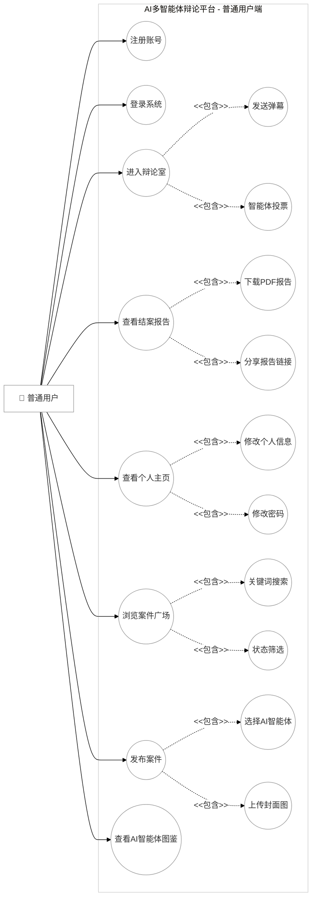

---

## 用例图2 案件发起者用例图

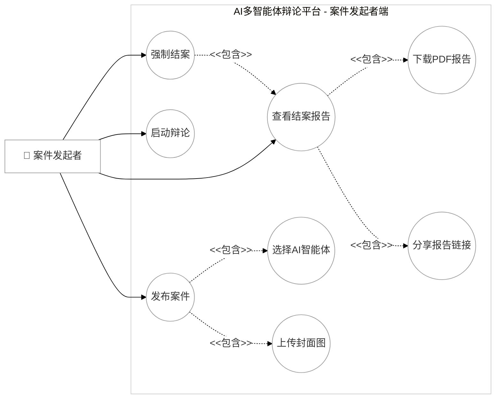

---

## 用例图3 管理员用例图

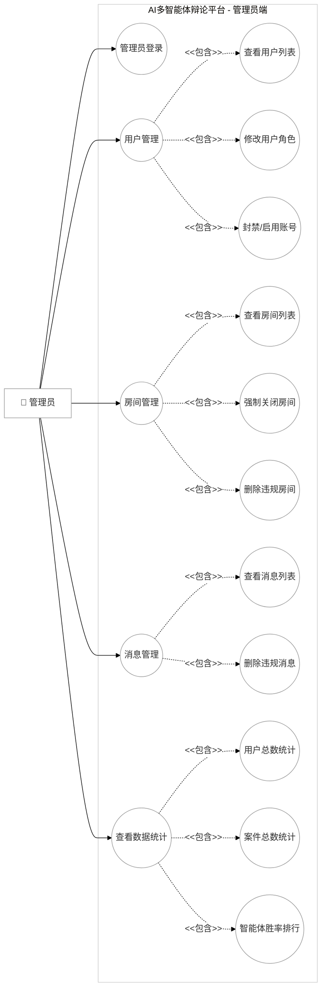

---

## 图1 系统总体架构图

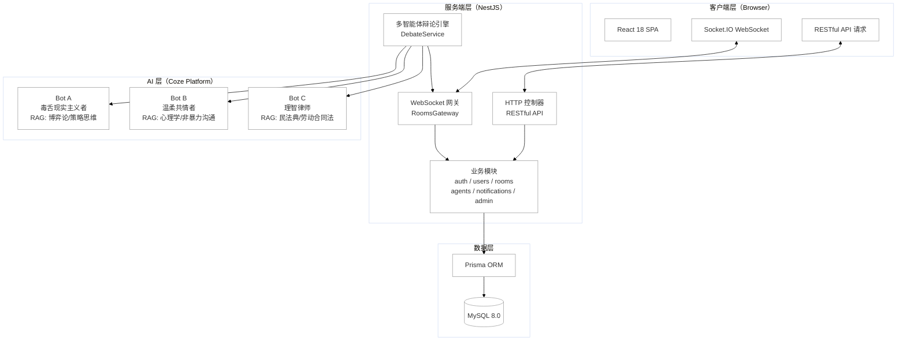

---

## 图2 登录注册流程图

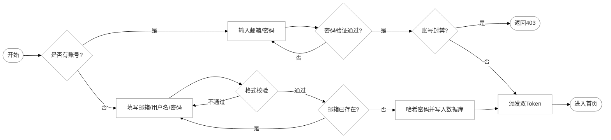

---

## 图3 案件广场流程图

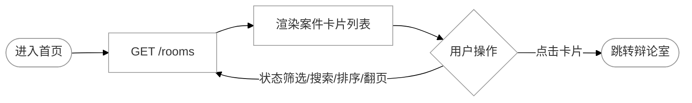

---

## 图4 发布案件流程图

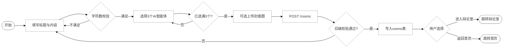

---

## 图5 辩论室流程图

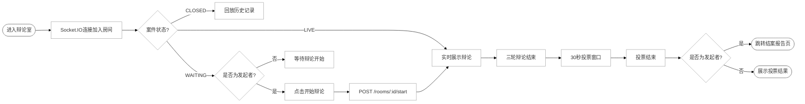

---

## 图6 投票流程图

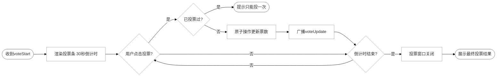

---

## 图7 结案报告流程图

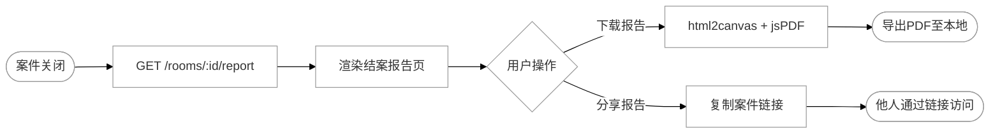

---

## 图8 个人主页流程图

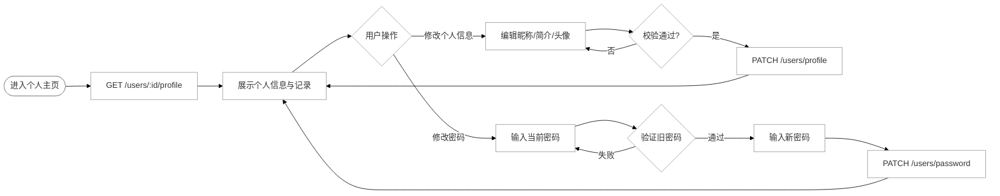

---

## 图9 用户管理流程图

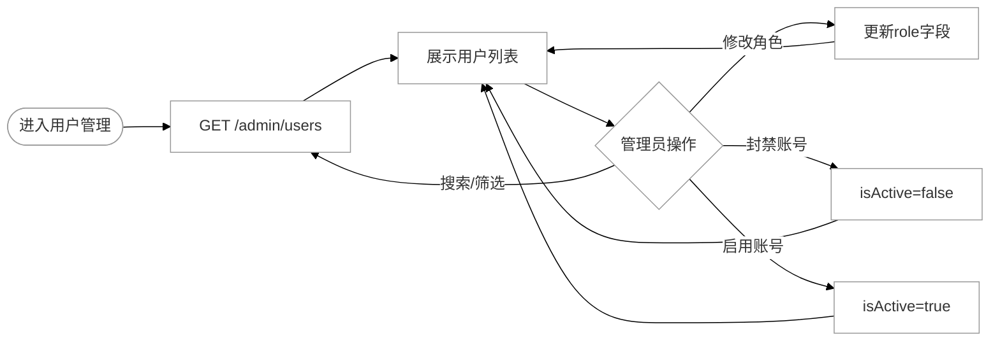

---

## 图10 房间管理流程图

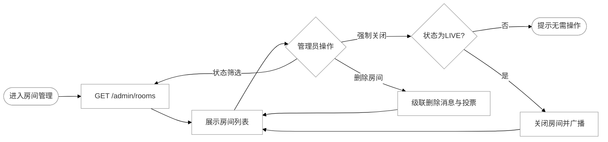

---

## 图11 多智能体辩论流程图

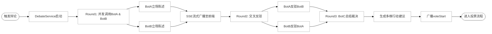

---

## 图12 系统 E-R 图

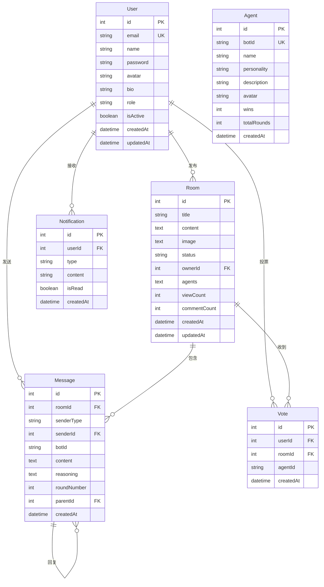

---

## 时序图1 登录功能

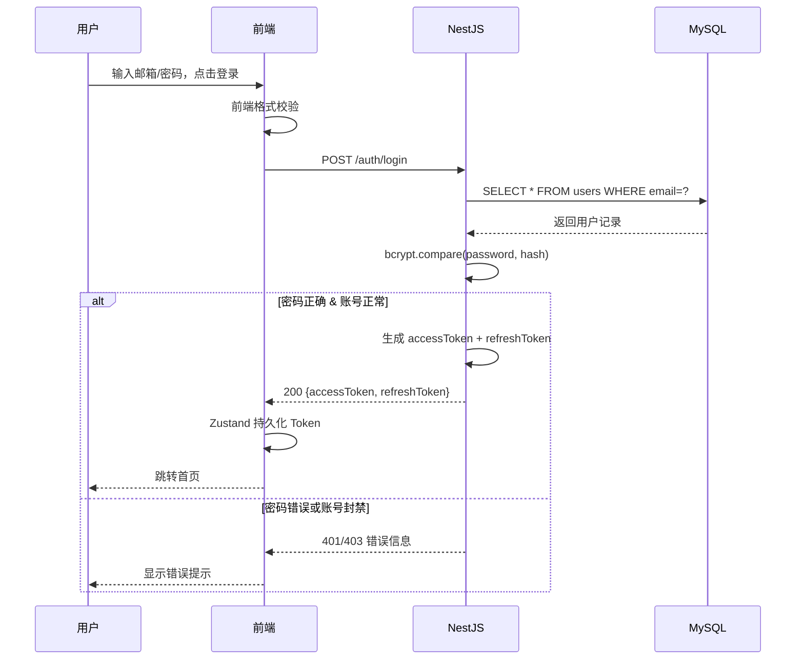

---

## 时序图2 发布案件功能

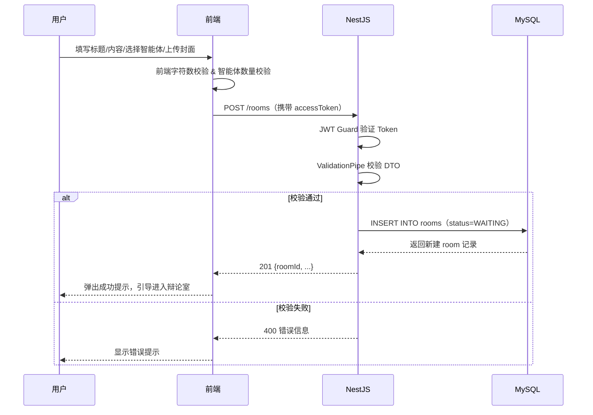

---

## 时序图3 多智能体辩论功能

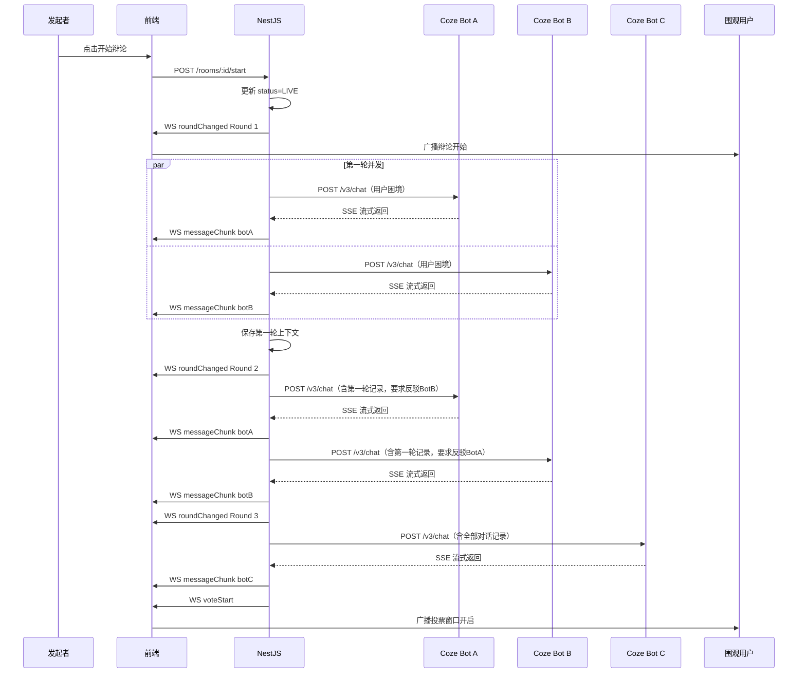

---

## 时序图4 投票功能

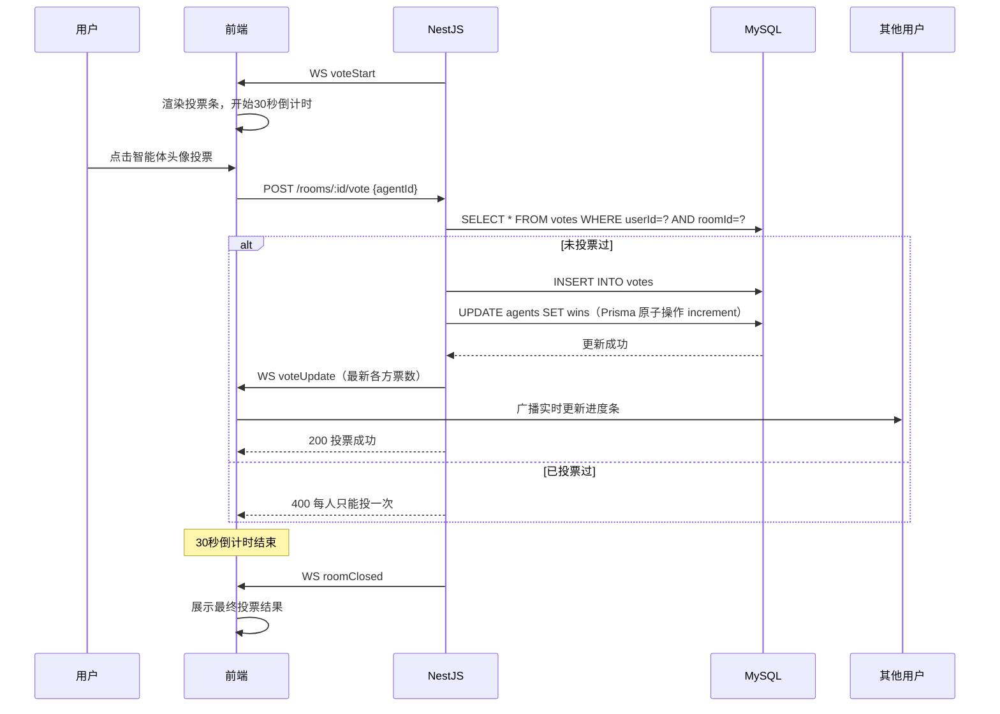
